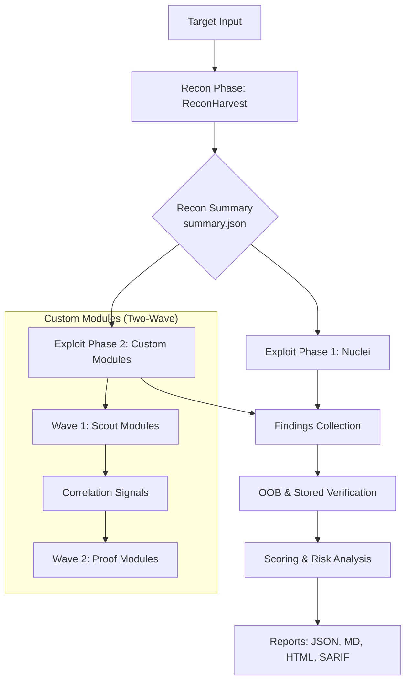

# BreachPilot

BreachPilot is a recon-to-exploit orchestrator. It automates the transition from surface discovery to targeted vulnerability verification, filtering out hardening noise to focus on real exploit candidates.

## 🚀 Installation & Setup

```bash
# 1. Build and install globally to /usr/local/bin (requires sudo)
make install

# 2. (Optional) Force update all recon dependencies
breachpilot update-tools

# 3. Verify everything is ready
breachpilot doctor
```

## 🛠 Quick Start

```bash
# Run the full flow: Recon -> Nuclei -> Exploit Modules
breachpilot full example.com

# Run with Aggressive mode (enables OOB/more intrusive checks)
breachpilot full example.com aggressive

# Run from an existing recon summary (skips recon phase)
breachpilot file path/to/summary.json

# Resume an interrupted job
breachpilot resume artifacts/example.com/1/.breachpilot.state
```

## 🔔 Webhooks & Notifications

BreachPilot supports two types of webhooks:

### 1. External Notifications (Discord/Slack)
Used for rich, mobile-friendly alerts. You can use separate channels to avoid noise:
- `BREACHPILOT_WEBHOOK_RECON`: (or `RECONHARVEST_WEBHOOK`) Specialized for recon discovery.
- `BREACHPILOT_WEBHOOK_EXPLOIT`: Specialized for exploit findings and critical vulnerabilities.
- `BREACHPILOT_WEBHOOK_INTERACTSH`: Dedicated channel for OOB/Interactsh callback data.

### 2. Internal Monitoring (BreachConsole)
Used to feed the real-time dashboard:
- `BREACHPILOT_WEBHOOK`: Universal stream to your local dashboard (`http://localhost:8080/api/webhooks/breachpilot`).

**Note**: You can provide multiple URLs separated by commas to stream to both Discord and BreachConsole simultaneously.

## 📋 Commands

- `breachpilot setup`: Performs initial dependency checks and basic tool installation.
- `breachpilot update-tools`: Reinstalls/updates all underlying recon binaries (e.g. subfinder, naabu).
- `breachpilot list-modules`: Shows all available exploit modules.
- `breachpilot doctor`: Checks environment health and tool accessibility.

## Local Config
Use:
- `breachpilot.env.example` as the template
- `breachpilot.env` for local runtime values

BreachPilot automatically loads `./breachpilot.env`. You can override it with `BREACHPILOT_CONFIG=/path/to/file`.

`BREACHPILOT_AGGRESSIVE` and `BREACHPILOT_BOUNDLESS` work as run defaults from `breachpilot.env`.
- If they are `true` in `breachpilot.env`, you do not need to pass `aggressive` or `boundless` on every command.
- If they are `false` in `breachpilot.env`, you can enable them only for the current run by adding `aggressive` and/or `boundless` to the CLI command.

## Recommended Config
For exploit-focused runs, these are the high-value settings:

```env
BREACHPILOT_SCAN_PROFILE=exploit
BREACHPILOT_AGGRESSIVE=true
BREACHPILOT_BOUNDLESS=false
BREACHPILOT_PROOF_MODE=true

BREACHPILOT_BROWSER_CAPTURE=true
BREACHPILOT_BROWSER_CAPTURE_MAX_PAGES=6
BREACHPILOT_BROWSER_CAPTURE_PER_PAGE_WAIT_MS=4000
BREACHPILOT_BROWSER_CAPTURE_SETTLE_WAIT_MS=1500
BREACHPILOT_BROWSER_CAPTURE_SCROLL_STEPS=3
BREACHPILOT_BROWSER_CAPTURE_MAX_ROUTES_PER_PAGE=10

BREACHPILOT_AUTH_USER_COOKIE=
BREACHPILOT_AUTH_ADMIN_COOKIE=
```

If you have authenticated user/admin context, provide it. That materially improves `idor-*`, `state-change`, `session-abuse`, and auth-differential modules.

## Scan Modes
- `full <target>`: run vendored ReconHarvest, then exploit modules
- `file <summary.json>`: skip recon and use an existing summary
- `resume <.breachpilot.state>`: continue an interrupted job

CLI flags override `breachpilot.env`. For example:

```bash
./breachpilot full example.com aggressive
./breachpilot full example.com aggressive boundless
./breachpilot file artifacts/example.com/1/recon/summary.json json aggressive
./breachpilot resume artifacts/example.com/1/.breachpilot.state aggressive boundless
```

## Architecture & Data Flow

BreachPilot follows a modular, phase-based architecture designed for efficiency and clear transitions between recon and exploit surface analysis.

### High-Level Data Flow



### Project Structure
```
BreachPilot/
├── cmd/breachpilot/     # CLI entry point & UI rendering
├── internal/
│   ├── config/          # ENV loading, recon command probing
│   ├── engine/          # Core scan pipeline (recon → nuclei → modules → report)
│   ├── exploit/         # Exploit module framework & 50+ modules
│   ├── ingest/          # Recon summary parsing
│   ├── models/          # Shared data types
│   ├── notify/          # Webhook/Discord notifications
│   ├── policy/          # Template safety policy
│   ├── scope/           # Target validation
│   ├── scoring/         # Risk scoring engine
│   └── testutil/        # Test helpers
├── tools/
│   └── reconharvest/    # Vendored recon tool (Python)
├── scripts/             # Setup & maintenance scripts
└── examples/            # Trigger examples
```

### Scan Lifecycle & State Machine

BreachPilot manages its execution state using a persistent state machine defined in [internal/engine/state.go](file:///home/ubuntu/.openclaw/workspace/BreachPilot/internal/engine/state.go). This allows for job resumption and ensures each phase completes successfully before moving to the next.

| State | Description | Triggered By |
|-------|-------------|--------------|
| `Started` | Job initialized and target validated. | `NewStateManager` |
| `ReconCompleted` | ReconHarvest has finished and `summary.json` is available. | `MarkReconCompleted` |
| `NucleiCompleted` | Nuclei scan has finished and `nuclei_findings.jsonl` is written. | `MarkNucleiCompleted` |
| `ModuleCompleted` | Individual custom exploit modules are tracked as they finish. | `MarkModuleCompleted` |

### Custom Exploit Modules: The Two-Wave Approach

To maximize impact while minimizing noise, custom modules are executed in two waves:

1.  **Scout Wave**: Broad analysis to identify potential vulnerability "signals" (e.g., discovering a sensitive endpoint or specific tech stack).
2.  **Proof Wave**: Targeted modules that use **Correlation Signals** from the Scout wave to perform specialized verification and Proof of Concept (PoC) generation.

For detailed information on creating new modules and using shared state patterns, see the [Exploit Module Developer Guide](file:///home/ubuntu/.openclaw/workspace/BreachPilot/internal/exploit/DEVELOPER_GUIDE.md).


Behavior summary:
- `breachpilot.env` applies generally to all runs on that machine or checkout.
- CLI options such as `aggressive` and `boundless` apply only to the current command.
- CLI options can enable a mode for one run even if the env default is `false`.

## 📺 Real-Time Monitoring: BreachConsole

BreachPilot includes a high-performance web dashboard called **BreachConsole** for real-time visualization of your scans.

### Features
- **Live Pipeline Stepper**: Track the exact progress of your recon and exploit phases.
- **Categorized Event Stream**: Recon findings and Exploit vulnerabilities are automatically sorted into dedicated tabs.
- **Interactive Stats**: Real-time counters for subdomains, live hosts, ports, and findings.
- **Multi-Channel Delivery**: Simultaneously stream to the console and multiple Discord/Slack webhooks.

### Starting the Console
To start both the backend and the frontend, simply run:
```bash
make dashboard
```
- **Dashboard UI**: `http://localhost:3000`
- **Webhook Ingest**: `http://localhost:8080/api/webhooks/breachpilot`

### Configuration
To see your data in the console, ensure your `breachpilot.env` includes:
```env
BREACHPILOT_WEBHOOK=http://localhost:8080/api/webhooks/breachpilot
```

## ⚙️ Configuration & Environment
... [rest of file]

### Scan Profiles & Behavior
- `BREACHPILOT_SCAN_PROFILE`: Choose `quick`, `standard`, `exploit`, or `deep`.
- `BREACHPILOT_AGGRESSIVE`: Enable intrusive checks.
- `BREACHPILOT_BOUNDLESS`: Remove timeouts for extensive scans.
- `BREACHPILOT_PROOF_MODE`: Enable active exploitation and PoC generation (use only on owned targets!).

### Filtering & Thresholds
- `BREACHPILOT_ONLY_MODULES`: Comma-separated list of exact modules to run.
- `BREACHPILOT_SKIP_MODULES`: Comma-separated list of modules to exclude.
- `BREACHPILOT_MIN_SEVERITY`: Minimum severity to report (e.g., `HIGH`).
- `BREACHPILOT_VALIDATION_ONLY`: Only run modules on previously found targets.

### Authentication Context
Providing context massively improves authenticated modules (e.g. IDOR, session abuse, auth-bypass):
- `BREACHPILOT_AUTH_USER_COOKIE` / `BREACHPILOT_AUTH_ADMIN_COOKIE`
- `BREACHPILOT_AUTH_USER_HEADERS` / `BREACHPILOT_AUTH_ADMIN_HEADERS`
- `BREACHPILOT_AUTH_ANON_HEADERS`

### Headless Browser Capture
- `BREACHPILOT_BROWSER_CAPTURE`: Set to `true` to enable screenshot evidence capture.
- `BREACHPILOT_BROWSER_CAPTURE_MAX_PAGES`: Limit the number of pages to capture per run.
- `BREACHPILOT_BROWSER_CAPTURE_SCROLL_STEPS`: Number of scrolls to capture full-page data.


## Outputs
Each run writes artifacts under `artifacts/<target>/<run-id>/`.

Common files:
- `runtime_config.json`
- `job_report.json`
- `exploit_findings.jsonl`
- `exploit_report.json`
- `exploit_report.md`
- `exploit_report.html`
- `proofs/`
- `poc/`

If `BREACHPILOT_PREVIOUS_REPORT` is set, the report also includes a diff against the earlier run.

`bbmd` and `bbpdf` outputs are always enforced so bug bounty markdown/PDF packs and per-finding PDFs are generated every run.

## Notes
- Use `recon/summary.json` as the input for `file` mode, not files under `recon/reports/`.
- `proof_mode` should be used only on owned or explicitly approved targets.
- `exploit` profile is the best default when you want real exploit candidates instead of mostly hardening findings.
