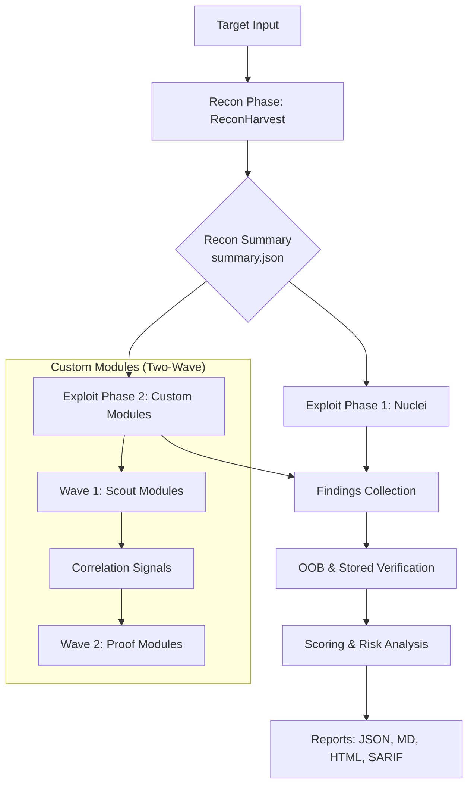

# BreachPilot

BreachPilot is a CLI-first recon-to-exploit orchestrator.

It can:
- run the full flow from recon to exploit
- consume an existing `recon/summary.json`
- score and filter findings into JSON, Markdown, HTML, and SARIF reports
- focus on exploit-oriented modules instead of broad hardening noise

ReconHarvest is vendored under `tools/reconharvest/` for portable full-mode runs.

## Quick Start
```bash
# preflight checks
./breachpilot setup

# full run: recon + exploit
./breachpilot full example.com

# exploit from an existing recon summary
./breachpilot file /absolute/path/to/recon/summary.json

# resume an interrupted job
./breachpilot resume artifacts/example.com/1/.breachpilot.state

# per-run aggressive + boundless execution
./breachpilot full example.com aggressive boundless

# machine-readable output
./breachpilot full example.com json

# list available exploit modules
./breachpilot list-modules

# environment and dependency check
./breachpilot doctor
```

## Build
```bash
make build
make vet
make test
```

## Local Config
Use:
- `breachpilot.env.example` as the template
- `breachpilot.env` for local runtime values

BreachPilot automatically loads `./breachpilot.env`. You can override it with `BREACHPILOT_CONFIG=/path/to/file`.

`BREACHPILOT_AGGRESSIVE` and `BREACHPILOT_BOUNDLESS` work as run defaults from `breachpilot.env`.
- If they are `true` in `breachpilot.env`, you do not need to pass `aggressive` or `boundless` on every command.
- If they are `false` in `breachpilot.env`, you can enable them only for the current run by adding `aggressive` and/or `boundless` to the CLI command.

## Recommended Config
For exploit-focused runs, these are the high-value settings:

```env
BREACHPILOT_SCAN_PROFILE=exploit
BREACHPILOT_AGGRESSIVE=true
BREACHPILOT_BOUNDLESS=false
BREACHPILOT_PROOF_MODE=true

BREACHPILOT_BROWSER_CAPTURE=true
BREACHPILOT_BROWSER_CAPTURE_MAX_PAGES=6
BREACHPILOT_BROWSER_CAPTURE_PER_PAGE_WAIT_MS=4000
BREACHPILOT_BROWSER_CAPTURE_SETTLE_WAIT_MS=1500
BREACHPILOT_BROWSER_CAPTURE_SCROLL_STEPS=3
BREACHPILOT_BROWSER_CAPTURE_MAX_ROUTES_PER_PAGE=10

BREACHPILOT_AUTH_USER_COOKIE=
BREACHPILOT_AUTH_ADMIN_COOKIE=
```

If you have authenticated user/admin context, provide it. That materially improves `idor-*`, `state-change`, `session-abuse`, and auth-differential modules.

## Scan Modes
- `full <target>`: run vendored ReconHarvest, then exploit modules
- `file <summary.json>`: skip recon and use an existing summary
- `resume <.breachpilot.state>`: continue an interrupted job

CLI flags override `breachpilot.env`. For example:

```bash
./breachpilot full example.com aggressive
./breachpilot full example.com aggressive boundless
./breachpilot file artifacts/example.com/1/recon/summary.json json aggressive
./breachpilot resume artifacts/example.com/1/.breachpilot.state aggressive boundless
```

## Architecture & Data Flow

BreachPilot follows a modular, phase-based architecture designed for efficiency and clear transitions between recon and exploit surface analysis.

### High-Level Data Flow



### Scan Lifecycle & State Machine

BreachPilot manages its execution state using a persistent state machine defined in [internal/engine/state.go](file:///home/ubuntu/.openclaw/workspace/BreachPilot/internal/engine/state.go). This allows for job resumption and ensures each phase completes successfully before moving to the next.

| State | Description | Triggered By |
|-------|-------------|--------------|
| `Started` | Job initialized and target validated. | `NewStateManager` |
| `ReconCompleted` | ReconHarvest has finished and `summary.json` is available. | `MarkReconCompleted` |
| `NucleiCompleted` | Nuclei scan has finished and `nuclei_findings.jsonl` is written. | `MarkNucleiCompleted` |
| `ModuleCompleted` | Individual custom exploit modules are tracked as they finish. | `MarkModuleCompleted` |

### Custom Exploit Modules: The Two-Wave Approach

To maximize impact while minimizing noise, custom modules are executed in two waves:

1.  **Scout Wave**: Broad analysis to identify potential vulnerability "signals" (e.g., discovering a sensitive endpoint or specific tech stack).
2.  **Proof Wave**: Targeted modules that use **Correlation Signals** from the Scout wave to perform specialized verification and Proof of Concept (PoC) generation.


Behavior summary:
- `breachpilot.env` applies generally to all runs on that machine or checkout.
- CLI options such as `aggressive` and `boundless` apply only to the current command.
- CLI options can enable a mode for one run even if the env default is `false`.

## Profiles
- `quick`: fast surface scan
- `standard`: balanced default
- `exploit`: proof-oriented exploit modules only
- `deep`: broader, slower run

`BREACHPILOT_ONLY_MODULES` and `BREACHPILOT_SKIP_MODULES` override the selected profile.

## Important Environment Variables
- `BREACHPILOT_SCAN_PROFILE`
- `BREACHPILOT_AGGRESSIVE`
- `BREACHPILOT_BOUNDLESS`
- `BREACHPILOT_PROOF_MODE`
- `BREACHPILOT_PROOF_TARGET_ALLOWLIST`
- `BREACHPILOT_ONLY_MODULES`
- `BREACHPILOT_SKIP_MODULES`
- `BREACHPILOT_VALIDATION_ONLY`
- `BREACHPILOT_MIN_SEVERITY`
- `BREACHPILOT_REPORT_FORMATS`
- `BREACHPILOT_PREVIOUS_REPORT`
- `BREACHPILOT_RATE_LIMIT_RPS`
- `BREACHPILOT_MODULE_TIMEOUT_SEC`
- `BREACHPILOT_MODULE_RETRIES`
- `BREACHPILOT_AUTH_USER_COOKIE`
- `BREACHPILOT_AUTH_ADMIN_COOKIE`
- `BREACHPILOT_AUTH_ANON_HEADERS`
- `BREACHPILOT_AUTH_USER_HEADERS`
- `BREACHPILOT_AUTH_ADMIN_HEADERS`
- `BREACHPILOT_BROWSER_CAPTURE`
- `BREACHPILOT_BROWSER_CAPTURE_MAX_PAGES`
- `BREACHPILOT_BROWSER_CAPTURE_PER_PAGE_WAIT_MS`
- `BREACHPILOT_BROWSER_CAPTURE_SETTLE_WAIT_MS`
- `BREACHPILOT_BROWSER_CAPTURE_SCROLL_STEPS`
- `BREACHPILOT_BROWSER_CAPTURE_MAX_ROUTES_PER_PAGE`

Webhook support is available through:
- `BREACHPILOT_WEBHOOK_RECON`
- `BREACHPILOT_WEBHOOK_EXPLOIT`
- `BREACHPILOT_WEBHOOK`
- `BREACHPILOT_WEBHOOK_SECRET`

## Outputs
Each run writes artifacts under `artifacts/<target>/<run-id>/`.

Common files:
- `runtime_config.json`
- `job_report.json`
- `exploit_findings.jsonl`
- `exploit_report.json`
- `exploit_report.md`
- `exploit_report.html`
- `proofs/`
- `poc/`

If `BREACHPILOT_PREVIOUS_REPORT` is set, the report also includes a diff against the earlier run.

## Notes
- Use `recon/summary.json` as the input for `file` mode, not files under `recon/reports/`.
- `proof_mode` should be used only on owned or explicitly approved targets.
- `exploit` profile is the best default when you want real exploit candidates instead of mostly hardening findings.
